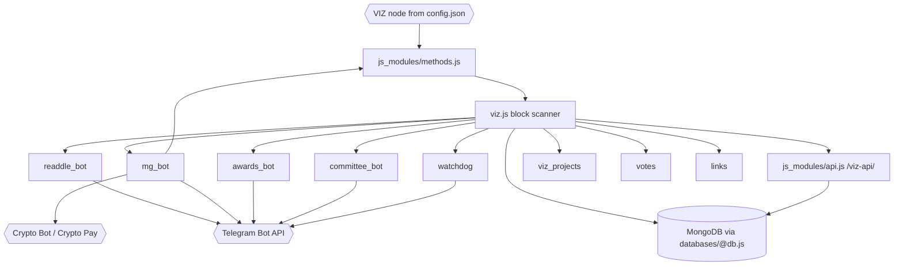
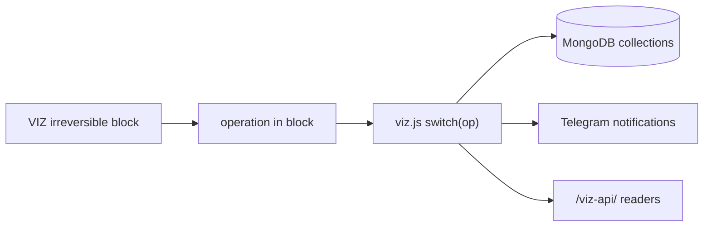

# Architecture

## High-level shape

`viz-apps` is a Node.js monolith around VIZ blockchain data and Telegram bots.

The process starts in [`../viz.js`](../viz.js). It loads [`../config.json`](../config.json), initializes MongoDB through [`../databases/@db.js`](../databases/@db.js), imports all application modules, starts the Express API module, starts Telegram bot command handlers through module imports, and then enters a block-scanning loop.

The application state is stored in MongoDB collections through files under [`../databases/`](../databases/). Blockchain reads and broadcasts go through [`../js_modules/methods.js`](../js_modules/methods.js), which wraps `viz-js-lib`.

## Main components

| Component | Code | Purpose |
|---|---|---|
| Main entrypoint | [`../viz.js`](../viz.js) | Connects MongoDB, imports modules, scans blocks, dispatches VIZ operations and starts timers. |
| VIZ wrapper | [`../js_modules/methods.js`](../js_modules/methods.js) | Wraps `viz-js-lib` API and broadcast calls. |
| HTTP API | [`../js_modules/api.js`](../js_modules/api.js) | Starts Express and serves `GET /viz-api/` on port `3100`. |
| MongoDB connector | [`../databases/@db.js`](../databases/@db.js) | Initializes MongoDB connection and reconnect logic. |
| Readdle bot | [`../js_modules/readdle_bot/`](../js_modules/readdle_bot/) | Telegram notifications and actions for Voice/Readdle posts. |
| mg_bot | [`../js_modules/mg_bot/`](../js_modules/mg_bot/) | Telegram game/social bot, VIZ scores, crypto bids and `buy_viz`. |
| Awards bot | [`../js_modules/awards_bot/`](../js_modules/awards_bot/) | Telegram notifications for VIZ award operations. |
| Committee bot | [`../js_modules/committee_bot/`](../js_modules/committee_bot/) | Committee request notifications and Telegram command handlers. |
| Watchdog | [`../js_modules/watchdog/`](../js_modules/watchdog/) | Witness/validator monitoring through Telegram. |
| VIZ Projects | [`../js_modules/viz_projects.js`](../js_modules/viz_projects.js) | Stores project/task/news data from VIZ transfers/custom operations. |
| Votes | [`../js_modules/votes.js`](../js_modules/votes.js) | Stores and counts VIZ poll data. |
| Links | [`../js_modules/links.js`](../js_modules/links.js) | Stores/searches VIZ links created through awards. |
| Prices/top/witness rewards | [`../js_modules/vizprice.js`](../js_modules/vizprice.js), [`../js_modules/viz_top.js`](../js_modules/viz_top.js), [`../js_modules/witness_rewards.js`](../js_modules/witness_rewards.js) | Background data collectors and API data sources. |

## Blockchain operation dispatch

[`../viz.js`](../viz.js) calls `processBlock(bn)` for each irreversible block loaded by `methods.getOpsInBlock(bn)`.

Handled operation cases in the current code:

- `witness_reward` → [`../js_modules/witness_rewards.js`](../js_modules/witness_rewards.js)
- `transfer` → VIZ Projects or Votes depending on target/account/memo.
- `custom` → Votes, VIZ Projects when `id === 'viz-projects'`, Readdle bot when `id === 'V'`.
- `benefactor_award` → Awards bot.
- `receive_award` → Awards bot, Links, and selected mg_bot workflows based on memo/receiver.
- `committee_worker_create_request` → Committee bot.
- `committee_pay_request` → Committee bot.

## HTTP API

[`../js_modules/api.js`](../js_modules/api.js) creates one Express route:

- `GET /viz-api/`

It supports these `service` values in current code:

- `top`
- `prices`
- `viz-projects`
- `witnesses`
- `links`
- `votes`

Details are in [API](api.md).

## Runtime timers

The current code starts several timers from [`../viz.js`](../viz.js):

- watchdog stall guard every 15 minutes;
- self-award interval for `mg_bot.award_account`;
- daily/monthly witness reward jobs;
- daily `mg_bot.scoresAward` job;
- `mg_bot.cryptoBidsResults` every 30 seconds;
- `checkAndWithdraw` interval every 600,000 ms.

[`../js_modules/committee_bot/index.js`](../js_modules/committee_bot/index.js) also starts intervals for committee request checks and language notifications.

## System diagram

## State diagram

