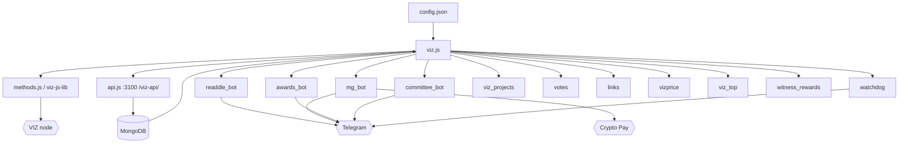
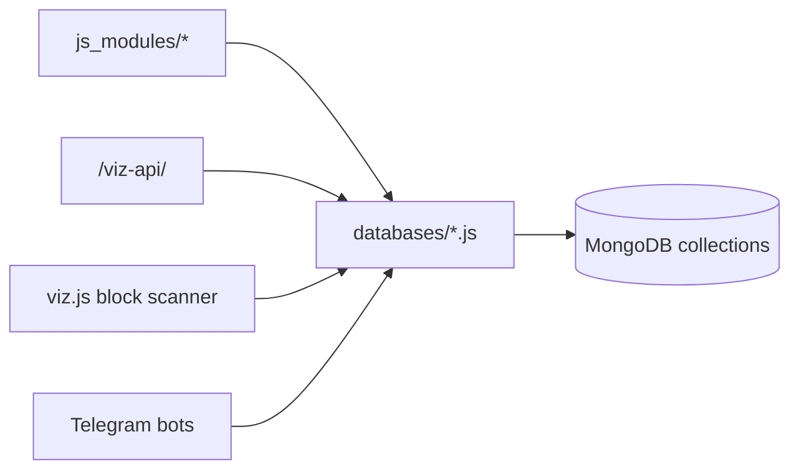

# Architecture diagrams

## Runtime component diagram

```mermaid
flowchart TD
    Config["config.json"] --> Main["viz.js"]
    Mongo[("MongoDB")] --> Main
    Main --> Methods["methods.js / viz-js-lib"]
    Methods --> VizNode{{"VIZ node"}}
    Main --> API["api.js :3100 /viz-api/"]
    API --> Mongo
    Main --> Readdle["readdle_bot"]
    Main --> MGBot["mg_bot"]
    Main --> Awards["awards_bot"]
    Main --> Committee["committee_bot"]
    Main --> Watchdog["watchdog"]
    Main --> Projects["viz_projects"]
    Main --> Votes["votes"]
    Main --> Links["links"]
    Main --> Prices["vizprice"]
    Main --> Top["viz_top"]
    Main --> WR["witness_rewards"]
    Readdle --> Telegram{{"Telegram"}}
    MGBot --> Telegram
    Awards --> Telegram
    Committee --> Telegram
    Watchdog --> Telegram
    MGBot --> CryptoPay{{"Crypto Pay"}}
```

## Data persistence diagram

```mermaid
flowchart LR
    Modules["js_modules/*"] --> DBHelpers["databases/*.js"]
    DBHelpers --> Mongo[("MongoDB collections")]
    API["/viz-api/"] --> DBHelpers
    BlockScanner["viz.js block scanner"] --> DBHelpers
    Bots["Telegram bots"] --> DBHelpers
```
