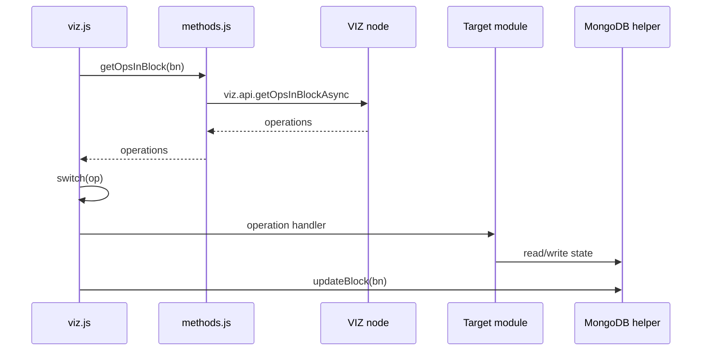
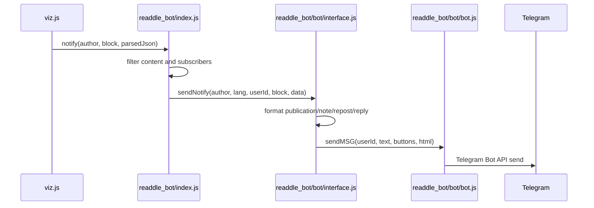
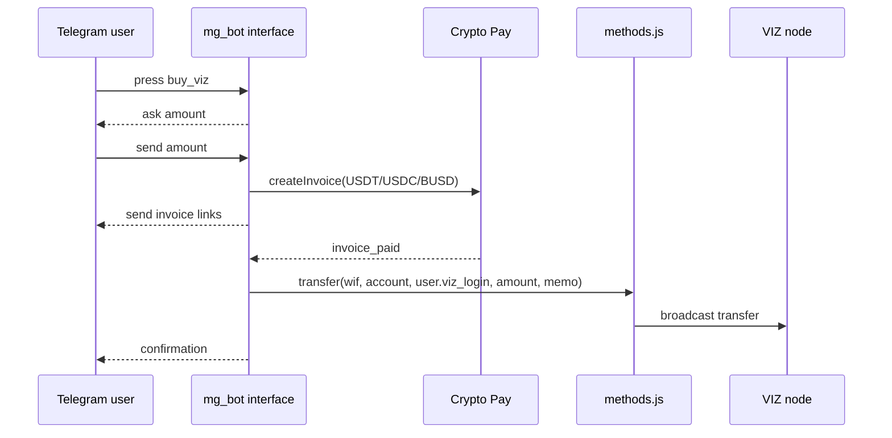
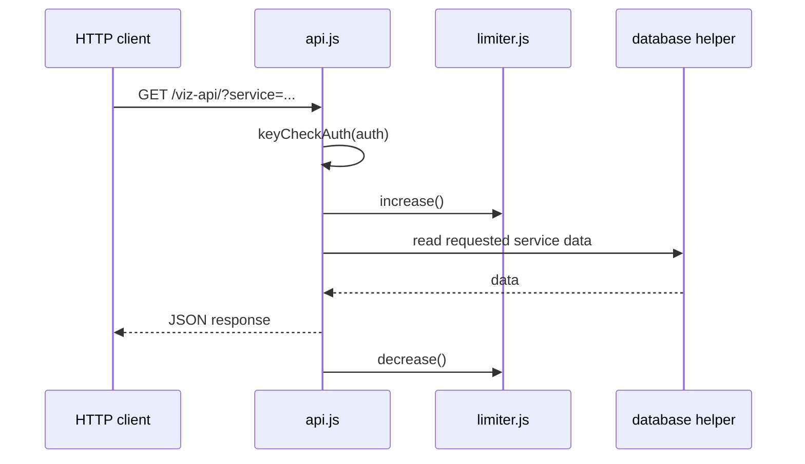

# Sequence diagrams

## Block scan and dispatch

```mermaid
sequenceDiagram
    participant Main as viz.js
    participant Methods as methods.js
    participant VIZ as VIZ node
    participant Module as Target module
    participant DB as MongoDB helper

    Main->>Methods: getOpsInBlock(bn)
    Methods->>VIZ: viz.api.getOpsInBlockAsync
    VIZ-->>Methods: operations
    Methods-->>Main: operations
    Main->>Main: switch(op)
    Main->>Module: operation handler
    Module->>DB: read/write state
    Main->>DB: updateBlock(bn)
```

## Voice publication notification

```mermaid
sequenceDiagram
    participant Main as viz.js
    participant RB as readdle_bot/index.js
    participant UI as readdle_bot/bot/interface.js
    participant Bot as readdle_bot/bot/bot.js
    participant Telegram as Telegram

    Main->>RB: notify(author, block, parsedJson)
    RB->>RB: filter content and subscribers
    RB->>UI: sendNotify(author, lang, userId, block, data)
    UI->>UI: format publication/note/repost/reply
    UI->>Bot: sendMSG(userId, text, buttons, html)
    Bot->>Telegram: Telegram Bot API send
```

## buy_viz payment-to-transfer

```mermaid
sequenceDiagram
    participant User as Telegram user
    participant MGBot as mg_bot interface
    participant CryptoPay as Crypto Pay
    participant Methods as methods.js
    participant VIZ as VIZ node

    User->>MGBot: press buy_viz
    MGBot-->>User: ask amount
    User->>MGBot: send amount
    MGBot->>CryptoPay: createInvoice(USDT/USDC/BUSD)
    MGBot-->>User: send invoice links
    CryptoPay-->>MGBot: invoice_paid
    MGBot->>Methods: transfer(wif, account, user.viz_login, amount, memo)
    Methods->>VIZ: broadcast transfer
    MGBot-->>User: confirmation
```

## API read flow

```mermaid
sequenceDiagram
    participant Client as HTTP client
    participant API as api.js
    participant Limiter as limiter.js
    participant DB as database helper

    Client->>API: GET /viz-api/?service=...
    API->>API: keyCheckAuth(auth)
    API->>Limiter: increase()
    API->>DB: read requested service data
    DB-->>API: data
    API-->>Client: JSON response
    API->>Limiter: decrease()
```
